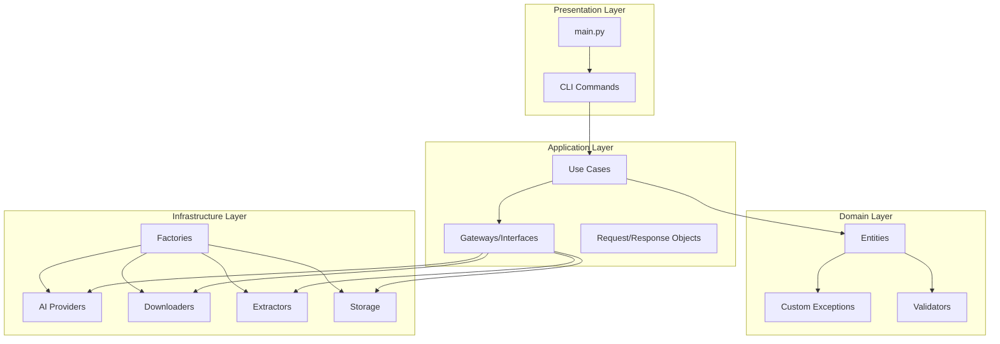
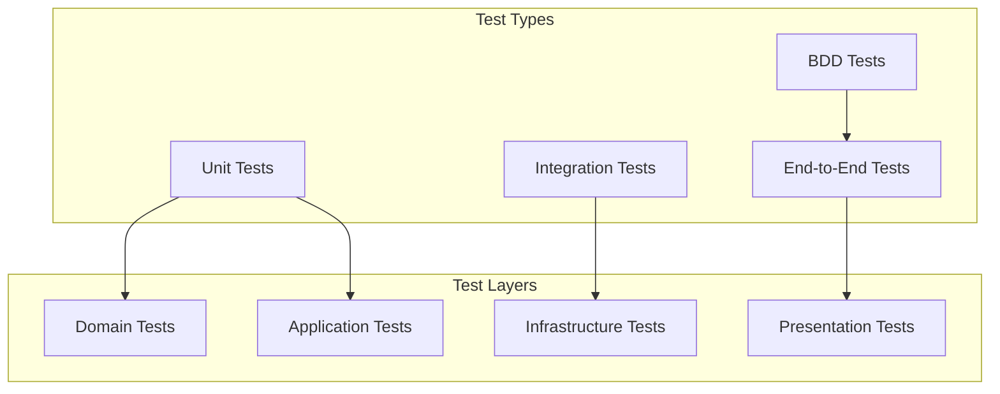

# Design Document

## Overview

Este documento detalha o design arquitetural para a refatoração completa do projeto Alfredo AI, transformando-o em uma implementação exemplar de Clean Architecture que atende 100% das diretrizes mandatórias. O design foca na criação de um sistema robusto, testável e extensível através da implementação sistemática de padrões de design, injeção de dependência, tratamento de erros específico e validação de domínio robusta.

A refatoração será executada em 4 fases incrementais, garantindo que funcionalidades existentes sejam preservadas enquanto a arquitetura é gradualmente melhorada. O design prioriza a separação clara de responsabilidades, baixo acoplamento e alta coesão.

## Architecture

### Clean Architecture Layers



### Dependency Flow

A arquitetura segue rigorosamente a regra de dependência da Clean Architecture:
- **Presentation** → **Application** → **Domain**
- **Infrastructure** → **Application** (através de interfaces)
- **Domain** não depende de nenhuma camada externa

## Components and Interfaces

### Domain Layer Components

#### Custom Exceptions Hierarchy

```python
# src/domain/exceptions/alfredo_errors.py
class AlfredoError(Exception):
    """Exceção base do Alfredo AI com suporte a detalhes estruturados"""
    def __init__(self, message: str, details: dict = None, cause: Exception = None):
        super().__init__(message)
        self.message = message
        self.details = details or {}
        self.cause = cause
        
    def to_dict(self) -> dict:
        return {
            "error_type": self.__class__.__name__,
            "message": self.message,
            "details": self.details,
            "cause": str(self.cause) if self.cause else None
        }

class ProviderUnavailableError(AlfredoError):
    """Provedor de IA indisponível ou com falha"""
    def __init__(self, provider_name: str, reason: str, details: dict = None):
        super().__init__(f"Provider {provider_name} indisponível: {reason}", details)
        self.provider_name = provider_name
        self.reason = reason

class DownloadFailedError(AlfredoError):
    """Falha no download de vídeo"""
    def __init__(self, url: str, reason: str, http_code: int = None):
        super().__init__(f"Falha no download de {url}: {reason}")
        self.url = url
        self.reason = reason
        self.http_code = http_code

class TranscriptionError(AlfredoError):
    """Erro na transcrição de áudio"""
    def __init__(self, audio_path: str, reason: str, provider: str = None):
        super().__init__(f"Erro na transcrição de {audio_path}: {reason}")
        self.audio_path = audio_path
        self.reason = reason
        self.provider = provider

class InvalidVideoFormatError(AlfredoError):
    """Formato de vídeo inválido ou dados inconsistentes"""
    def __init__(self, field: str, value: any, constraint: str):
        super().__init__(f"Campo {field} inválido: {constraint}")
        self.field = field
        self.value = value
        self.constraint = constraint

class ConfigurationError(AlfredoError):
    """Erro de configuração do sistema"""
    def __init__(self, config_key: str, reason: str, expected: str = None):
        super().__init__(f"Configuração {config_key} inválida: {reason}")
        self.config_key = config_key
        self.reason = reason
        self.expected = expected
```

#### Enhanced Video Entity

```python
# src/domain/entities/video.py
@dataclass
class Video:
    id: str
    title: str
    duration: float = 0.0
    file_path: Optional[str] = None
    url: Optional[str] = None
    created_at: Optional[datetime] = None
    metadata: Optional[dict] = None
    transcription: Optional[str] = None
    summary: Optional[str] = None
    
    def __post_init__(self) -> None:
        if self.created_at is None:
            self.created_at = datetime.now()
        if self.metadata is None:
            self.metadata = {}
        
        # Validações robustas
        self._validate_id()
        self._validate_title()
        self._validate_sources()
        self._validate_duration()
    
    def _validate_id(self) -> None:
        if not self.id or not self.id.strip():
            raise InvalidVideoFormatError("id", self.id, "não pode ser vazio")
        
        if len(self.id) > 255:
            raise InvalidVideoFormatError("id", self.id, "máximo 255 caracteres")
        
        # Validar caracteres permitidos
        if not re.match(r'^[a-zA-Z0-9_-]+$', self.id):
            raise InvalidVideoFormatError("id", self.id, "apenas letras, números, _ e -")
    
    def _validate_title(self) -> None:
        if not self.title or not self.title.strip():
            raise InvalidVideoFormatError("title", self.title, "não pode ser vazio")
        
        if len(self.title) > 500:
            raise InvalidVideoFormatError("title", self.title, "máximo 500 caracteres")
    
    def _validate_sources(self) -> None:
        has_file = self.file_path and Path(self.file_path).exists()
        has_url = self.url and self._is_valid_url(self.url)
        
        if not has_file and not has_url:
            raise InvalidVideoFormatError("sources", None, "deve ter file_path válido ou URL válida")
    
    def _validate_duration(self) -> None:
        if self.duration < 0:
            raise InvalidVideoFormatError("duration", self.duration, "não pode ser negativa")
        
        if self.duration > 86400:  # 24 horas
            raise InvalidVideoFormatError("duration", self.duration, "máximo 24 horas")
    
    def _is_valid_url(self, url: str) -> bool:
        url_pattern = re.compile(
            r'^https?://'
            r'(?:(?:[A-Z0-9](?:[A-Z0-9-]{0,61}[A-Z0-9])?\.)+[A-Z]{2,6}\.?|'
            r'localhost|'
            r'\d{1,3}\.\d{1,3}\.\d{1,3}\.\d{1,3})'
            r'(?::\d+)?'
            r'(?:/?|[/?]\S+)$', re.IGNORECASE)
        return bool(url_pattern.match(url))
```

### Application Layer Components

#### Gateway Interfaces

```python
# src/application/gateways/video_downloader.py
class VideoDownloaderGateway(ABC):
    @abstractmethod
    async def download(self, url: str, output_dir: str, quality: str = "best") -> str:
        """Baixa vídeo e retorna caminho do arquivo baixado"""
        pass
    
    @abstractmethod
    async def extract_info(self, url: str) -> dict:
        """Extrai metadados do vídeo sem baixar"""
        pass
    
    @abstractmethod
    async def get_available_formats(self, url: str) -> List[dict]:
        """Lista formatos disponíveis para download"""
        pass

# src/application/gateways/audio_extractor.py
class AudioExtractorGateway(ABC):
    @abstractmethod
    async def extract_audio(self, video_path: str, output_path: str, 
                          format: str = "wav", sample_rate: int = 16000) -> str:
        """Extrai áudio do vídeo com configurações específicas"""
        pass
    
    @abstractmethod
    async def get_audio_info(self, video_path: str) -> dict:
        """Obtém informações do áudio sem extrair"""
        pass

# src/application/gateways/storage_gateway.py
class StorageGateway(ABC):
    @abstractmethod
    async def save_video(self, video: Video) -> None:
        """Salva metadados do vídeo"""
        pass
    
    @abstractmethod
    async def load_video(self, video_id: str) -> Optional[Video]:
        """Carrega vídeo por ID"""
        pass
    
    @abstractmethod
    async def save_transcription(self, video_id: str, transcription: str, 
                               metadata: dict = None) -> None:
        """Salva transcrição com metadados opcionais"""
        pass
    
    @abstractmethod
    async def load_transcription(self, video_id: str) -> Optional[str]:
        """Carrega transcrição por video ID"""
        pass
    
    @abstractmethod
    async def list_videos(self, limit: int = 100, offset: int = 0) -> List[Video]:
        """Lista vídeos com paginação"""
        pass
```

#### Enhanced Use Cases

```python
# src/application/use_cases/process_youtube_video.py
class ProcessYouTubeVideoUseCase:
    def __init__(self, 
                 video_repository: StorageGateway,
                 ai_provider: AIProviderInterface,
                 downloader: VideoDownloaderGateway,
                 extractor: AudioExtractorGateway,
                 config: AlfredoConfig):
        self._video_repository = video_repository
        self._ai_provider = ai_provider
        self._downloader = downloader
        self._extractor = extractor
        self._config = config
    
    async def execute(self, request: ProcessYouTubeVideoRequest) -> ProcessYouTubeVideoResponse:
        try:
            # 1. Validar URL e extrair informações
            video_info = await self._downloader.extract_info(request.url)
            
            # 2. Criar entidade Video com validação
            video = Video(
                id=self._generate_video_id(video_info),
                title=video_info.get('title', 'Unknown'),
                duration=video_info.get('duration', 0),
                url=request.url,
                metadata=video_info
            )
            
            # 3. Verificar se já foi processado
            existing = await self._video_repository.load_video(video.id)
            if existing and not request.force_reprocess:
                return ProcessYouTubeVideoResponse(video=existing, was_cached=True)
            
            # 4. Download do vídeo
            video_path = await self._downloader.download(
                request.url, 
                self._config.data_dir / "input" / "youtube"
            )
            video.file_path = video_path
            
            # 5. Extração de áudio
            audio_path = await self._extractor.extract_audio(
                video_path,
                self._config.data_dir / "temp" / f"{video.id}.wav"
            )
            
            # 6. Transcrição
            transcription = await self._ai_provider.transcribe_audio(
                audio_path, 
                request.language
            )
            video.transcription = transcription
            
            # 7. Sumarização (opcional)
            if request.generate_summary:
                summary = await self._ai_provider.generate_summary(
                    transcription, 
                    video.title
                )
                video.summary = summary
            
            # 8. Salvar resultados
            await self._video_repository.save_video(video)
            await self._video_repository.save_transcription(
                video.id, 
                transcription,
                {"language": request.language, "provider": self._ai_provider.name}
            )
            
            # 9. Limpeza de arquivos temporários
            await self._cleanup_temp_files(audio_path)
            
            return ProcessYouTubeVideoResponse(video=video, was_cached=False)
            
        except Exception as e:
            # Converter exceções genéricas em específicas
            if "download" in str(e).lower():
                raise DownloadFailedError(request.url, str(e))
            elif "transcription" in str(e).lower():
                raise TranscriptionError(audio_path if 'audio_path' in locals() else "", str(e))
            else:
                raise AlfredoError(f"Erro no processamento: {str(e)}", cause=e)
```

### Infrastructure Layer Components

#### Factory Pattern Implementation

```python
# src/infrastructure/factories/infrastructure_factory.py
class InfrastructureFactory:
    def __init__(self, config: AlfredoConfig):
        self._config = config
        self._instances = {}  # Cache de instâncias singleton
    
    def create_video_downloader(self) -> VideoDownloaderGateway:
        if 'downloader' not in self._instances:
            self._instances['downloader'] = YTDLPDownloader(self._config)
        return self._instances['downloader']
    
    def create_audio_extractor(self) -> AudioExtractorGateway:
        if 'extractor' not in self._instances:
            self._instances['extractor'] = FFmpegExtractor(self._config)
        return self._instances['extractor']
    
    def create_ai_provider(self, provider_type: str = None) -> AIProviderInterface:
        provider_type = provider_type or self._config.default_ai_provider
        cache_key = f'ai_provider_{provider_type}'
        
        if cache_key not in self._instances:
            if provider_type == "whisper":
                self._instances[cache_key] = WhisperProvider(self._config)
            elif provider_type == "groq":
                self._instances[cache_key] = GroqProvider(self._config)
            elif provider_type == "ollama":
                self._instances[cache_key] = OllamaProvider(self._config)
            else:
                raise ConfigurationError(
                    "ai_provider", 
                    f"Provider '{provider_type}' não suportado",
                    "whisper, groq, ollama"
                )
        
        return self._instances[cache_key]
    
    def create_storage(self, storage_type: str = "filesystem") -> StorageGateway:
        cache_key = f'storage_{storage_type}'
        
        if cache_key not in self._instances:
            if storage_type == "filesystem":
                self._instances[cache_key] = FileSystemStorage(self._config)
            elif storage_type == "json":
                self._instances[cache_key] = JsonStorage(self._config)
            else:
                raise ConfigurationError(
                    "storage_type",
                    f"Storage '{storage_type}' não suportado",
                    "filesystem, json"
                )
        
        return self._instances[cache_key]
    
    def create_all_dependencies(self) -> dict:
        """Cria todas as dependências de uma vez para injeção em Use Cases"""
        return {
            'downloader': self.create_video_downloader(),
            'extractor': self.create_audio_extractor(),
            'ai_provider': self.create_ai_provider(),
            'storage': self.create_storage(),
            'config': self._config
        }
```

#### Centralized Configuration

```python
# src/config/alfredo_config.py
@dataclass
class AlfredoConfig:
    # Modelos de IA
    groq_model: str = "llama-3.3-70b-versatile"
    ollama_model: str = "llama3:8b"
    whisper_model: str = "base"
    default_ai_provider: str = "whisper"
    
    # Timeouts e Limites
    max_video_duration: int = 3600  # 1 hora
    download_timeout: int = 300     # 5 minutos
    transcription_timeout: int = 600 # 10 minutos
    max_file_size_mb: int = 500
    max_concurrent_downloads: int = 3
    
    # Diretórios
    base_dir: Path = field(default_factory=lambda: Path(__file__).parent.parent.parent)
    data_dir: Optional[Path] = None
    temp_dir: Optional[Path] = None
    
    # API Keys e Credenciais
    groq_api_key: Optional[str] = field(default_factory=lambda: os.getenv("GROQ_API_KEY"))
    openai_api_key: Optional[str] = field(default_factory=lambda: os.getenv("OPENAI_API_KEY"))
    
    # Configurações de Processamento
    default_language: str = "pt"
    scene_threshold: float = 30.0
    audio_sample_rate: int = 16000
    video_quality: str = "best"
    
    # Configurações de Log
    log_level: str = "INFO"
    log_format: str = "%(asctime)s - %(name)s - %(levelname)s - %(message)s"
    
    def __post_init__(self):
        # Configurar diretórios padrão
        if self.data_dir is None:
            self.data_dir = self.base_dir / "data"
        if self.temp_dir is None:
            self.temp_dir = self.data_dir / "temp"
        
        # Validações críticas
        self._validate_timeouts()
        self._validate_limits()
        self._validate_directories()
    
    def _validate_timeouts(self) -> None:
        if self.max_video_duration <= 0:
            raise ConfigurationError("max_video_duration", "deve ser positivo", "> 0")
        
        if self.download_timeout <= 0:
            raise ConfigurationError("download_timeout", "deve ser positivo", "> 0")
        
        if self.transcription_timeout <= 0:
            raise ConfigurationError("transcription_timeout", "deve ser positivo", "> 0")
    
    def _validate_limits(self) -> None:
        if self.scene_threshold < 0:
            raise ConfigurationError("scene_threshold", "deve ser não-negativo", ">= 0")
        
        if self.max_file_size_mb <= 0:
            raise ConfigurationError("max_file_size_mb", "deve ser positivo", "> 0")
        
        if self.max_concurrent_downloads <= 0:
            raise ConfigurationError("max_concurrent_downloads", "deve ser positivo", "> 0")
    
    def _validate_directories(self) -> None:
        try:
            self.data_dir.mkdir(parents=True, exist_ok=True)
            self.temp_dir.mkdir(parents=True, exist_ok=True)
        except PermissionError as e:
            raise ConfigurationError("directories", f"sem permissão para criar: {e}")
    
    def validate_runtime(self) -> None:
        """Validações que dependem de recursos externos"""
        if self.default_ai_provider == "groq" and not self.groq_api_key:
            raise ConfigurationError("groq_api_key", "obrigatória para provider groq")
        
        if self.default_ai_provider == "openai" and not self.openai_api_key:
            raise ConfigurationError("openai_api_key", "obrigatória para provider openai")
    
    def create_directory_structure(self) -> None:
        """Cria toda a estrutura de diretórios necessária"""
        directories = [
            self.data_dir / "input" / "local",
            self.data_dir / "input" / "youtube",
            self.data_dir / "output" / "transcriptions",
            self.data_dir / "output" / "summaries",
            self.data_dir / "logs",
            self.temp_dir,
            self.data_dir / "cache"
        ]
        
        for directory in directories:
            directory.mkdir(parents=True, exist_ok=True)
    
    def get_provider_config(self, provider_name: str) -> dict:
        """Retorna configuração específica do provider"""
        configs = {
            "whisper": {
                "model": self.whisper_model,
                "timeout": self.transcription_timeout
            },
            "groq": {
                "model": self.groq_model,
                "api_key": self.groq_api_key,
                "timeout": self.transcription_timeout
            },
            "ollama": {
                "model": self.ollama_model,
                "timeout": self.transcription_timeout
            }
        }
        
        if provider_name not in configs:
            raise ConfigurationError("provider_name", f"Provider '{provider_name}' não configurado")
        
        return configs[provider_name]
```

### Presentation Layer Components

#### Command Pattern Implementation

```python
# src/presentation/cli/commands/base_command.py
class Command(ABC):
    def __init__(self, config: AlfredoConfig, factory: InfrastructureFactory):
        self.config = config
        self.factory = factory
        self.logger = logging.getLogger(self.__class__.__name__)
    
    @abstractmethod
    async def execute(self, *args, **kwargs) -> None:
        """Executa o comando principal"""
        pass
    
    @abstractmethod
    def validate_args(self, *args, **kwargs) -> bool:
        """Valida argumentos antes da execução"""
        pass
    
    def handle_error(self, error: Exception) -> None:
        """Trata erros de forma padronizada"""
        if isinstance(error, DownloadFailedError):
            print(f"❌ Erro no download: {error.message}")
            if error.http_code:
                print(f"   Código HTTP: {error.http_code}")
        elif isinstance(error, TranscriptionError):
            print(f"❌ Erro na transcrição: {error.message}")
            print(f"   Arquivo: {error.audio_path}")
        elif isinstance(error, ConfigurationError):
            print(f"❌ Erro de configuração: {error.message}")
            if error.expected:
                print(f"   Esperado: {error.expected}")
        elif isinstance(error, InvalidVideoFormatError):
            print(f"❌ Formato inválido: {error.message}")
            print(f"   Campo: {error.field}, Valor: {error.value}")
        else:
            print(f"❌ Erro inesperado: {str(error)}")
            self.logger.error(f"Erro não tratado: {error}", exc_info=True)

# src/presentation/cli/commands/youtube_command.py
class YouTubeCommand(Command):
    def __init__(self, config: AlfredoConfig, factory: InfrastructureFactory):
        super().__init__(config, factory)
        self.use_case = ProcessYouTubeVideoUseCase(**factory.create_all_dependencies())
    
    def validate_args(self, url: str, **kwargs) -> bool:
        if not url:
            print("❌ URL é obrigatória")
            return False
        
        if not url.startswith(('http://', 'https://')):
            print("❌ URL deve começar com http:// ou https://")
            return False
        
        return True
    
    async def execute(self, url: str, language: str = "pt", 
                     generate_summary: bool = False, force: bool = False) -> None:
        if not self.validate_args(url):
            return
        
        try:
            print(f"🎬 Processando vídeo: {url}")
            
            request = ProcessYouTubeVideoRequest(
                url=url,
                language=language,
                generate_summary=generate_summary,
                force_reprocess=force
            )
            
            with tqdm(desc="Processando", unit="etapa") as pbar:
                response = await self.use_case.execute(request)
                pbar.update(1)
            
            if response.was_cached:
                print(f"✅ Vídeo já processado (cache): {response.video.title}")
            else:
                print(f"✅ Vídeo processado com sucesso: {response.video.title}")
            
            print(f"📝 Transcrição: {len(response.video.transcription)} caracteres")
            if response.video.summary:
                print(f"📋 Resumo gerado: {len(response.video.summary)} caracteres")
            
        except Exception as error:
            self.handle_error(error)
```

## Data Models

### Request/Response Objects

```python
# src/application/dtos/process_youtube_video.py
@dataclass
class ProcessYouTubeVideoRequest:
    url: str
    language: str = "pt"
    generate_summary: bool = False
    force_reprocess: bool = False
    quality: str = "best"
    
    def __post_init__(self):
        if not self.url:
            raise InvalidVideoFormatError("url", self.url, "não pode ser vazia")
        
        if self.language not in ["pt", "en", "es", "fr", "de"]:
            raise InvalidVideoFormatError("language", self.language, "idioma não suportado")

@dataclass
class ProcessYouTubeVideoResponse:
    video: Video
    was_cached: bool = False
    processing_time: Optional[float] = None
    metadata: Optional[dict] = None
```

## Error Handling

### Error Handling Strategy

1. **Specific Exceptions**: Todas as exceções herdam de `AlfredoError` com informações estruturadas
2. **Error Context**: Exceções incluem contexto relevante (URLs, paths, configurações)
3. **Error Propagation**: Erros são propagados através das camadas mantendo contexto
4. **User-Friendly Messages**: Camada de apresentação converte exceções técnicas em mensagens amigáveis
5. **Logging**: Erros são logados com nível apropriado e stack trace quando necessário

### Error Recovery Mechanisms

```python
# src/application/use_cases/resilient_processing.py
class ResilientProcessingMixin:
    async def with_retry(self, operation: Callable, max_retries: int = 3, 
                        backoff_factor: float = 2.0) -> Any:
        """Executa operação com retry exponential backoff"""
        for attempt in range(max_retries):
            try:
                return await operation()
            except (ProviderUnavailableError, DownloadFailedError) as e:
                if attempt == max_retries - 1:
                    raise e
                
                wait_time = backoff_factor ** attempt
                self.logger.warning(f"Tentativa {attempt + 1} falhou: {e}. Tentando novamente em {wait_time}s")
                await asyncio.sleep(wait_time)
    
    async def with_fallback(self, primary_operation: Callable, 
                           fallback_operation: Callable) -> Any:
        """Executa operação com fallback automático"""
        try:
            return await primary_operation()
        except Exception as e:
            self.logger.warning(f"Operação primária falhou: {e}. Usando fallback.")
            return await fallback_operation()
```

## Testing Strategy

### Test Architecture



### BDD Test Implementation

```python
# tests/bdd/features/youtube_processing.feature
Feature: Processamento de vídeos do YouTube
  Como usuário do sistema
  Quero processar vídeos do YouTube
  Para obter transcrições e resumos automaticamente

  Background:
    Given que o sistema está configurado corretamente
    And que tenho conectividade com a internet

  Scenario: Processamento bem-sucedido de vídeo válido
    Given que tenho uma URL válida do YouTube "https://youtube.com/watch?v=dQw4w9WgXcQ"
    When executo o processamento do vídeo
    Then devo receber uma transcrição válida
    And devo receber metadados do vídeo
    And o resultado deve ser salvo no repositório
    And o arquivo temporário deve ser removido

  Scenario: Tratamento de URL inválida
    Given que tenho uma URL inválida "not-a-url"
    When executo o processamento do vídeo
    Then devo receber um erro de formato inválido
    And nenhum arquivo deve ser criado

  Scenario: Recuperação de falha de download
    Given que tenho uma URL que falha no download
    When executo o processamento do vídeo
    Then o sistema deve tentar novamente até 3 vezes
    And se todas as tentativas falharem, deve retornar erro específico
```

### Test Coverage Strategy

1. **Unit Tests**: 100% cobertura para Use Cases, Entities e Validators
2. **Integration Tests**: Testes com dependências reais (filesystem, APIs externas)
3. **BDD Tests**: Cenários de usuário end-to-end
4. **Performance Tests**: Validação de timeouts e limites de recursos
5. **Security Tests**: Validação de inputs maliciosos e sanitização

### Mock Strategy

```python
# tests/fixtures/mocks.py
class MockVideoDownloaderGateway(VideoDownloaderGateway):
    def __init__(self, should_fail: bool = False):
        self.should_fail = should_fail
        self.download_calls = []
        self.extract_info_calls = []
    
    async def download(self, url: str, output_dir: str, quality: str = "best") -> str:
        self.download_calls.append((url, output_dir, quality))
        
        if self.should_fail:
            raise DownloadFailedError(url, "Mock failure", 404)
        
        return f"/mock/path/{url.split('/')[-1]}.mp4"
    
    async def extract_info(self, url: str) -> dict:
        self.extract_info_calls.append(url)
        
        return {
            "title": "Mock Video Title",
            "duration": 120,
            "uploader": "Mock Channel"
        }
```

## Implementation Phases

### Phase 1: Critical Foundations (Week 1-2)
- Implement custom exceptions hierarchy
- Create factory pattern and dependency injection
- Implement infrastructure gateways
- Refactor existing Use Cases to use new architecture

### Phase 2: Configuration and Validation (Week 3)
- Implement centralized typed configuration
- Strengthen domain validation
- Update all components to use new configuration

### Phase 3: Presentation and Integration (Week 4)
- Refactor presentation layer with command pattern
- Implement missing design patterns
- Clean up main.py and CLI interface

### Phase 4: Quality and Robustness (Week 5)
- Expand test coverage with BDD scenarios
- Implement quality metrics and automation
- Performance optimization and security hardening

## Quality Metrics

### Code Quality Targets
- **Test Coverage**: ≥ 80%
- **Cyclomatic Complexity**: ≤ 10 per function
- **Lines per Function**: ≤ 20
- **Lines per Class**: ≤ 200
- **Code Duplication**: ≤ 3%

### Architecture Compliance
- **SOLID Violations**: 0
- **Dependency Rule Violations**: 0
- **Magic Numbers/Strings**: 0
- **Generic Exception Usage**: 0
- **Direct Infrastructure Instantiation in Use Cases**: 0

Este design garante uma implementação robusta, testável e extensível que atende 100% das diretrizes mandatórias definidas no steering, servindo como referência de excelência em Clean Architecture para projetos Python.