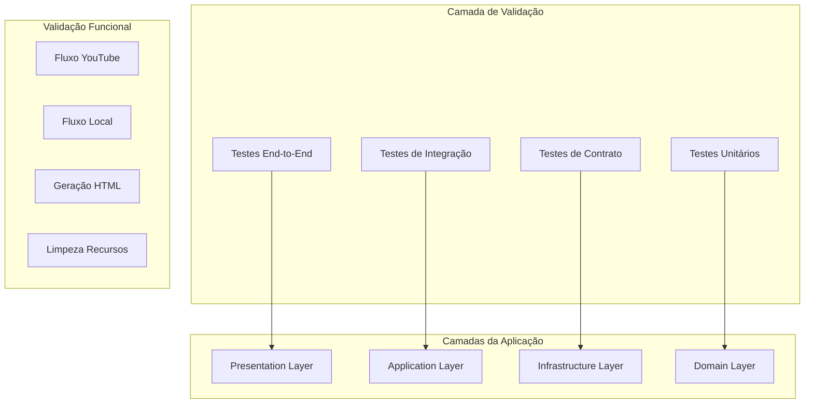
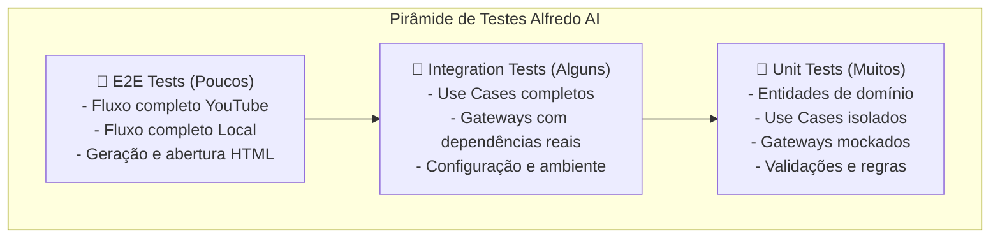

# Design Document

## Overview

Este documento define a estratégia de design para garantir que o sistema Alfredo AI esteja 100% funcional após a refatoração para Clean Architecture. O design foca em validação abrangente, testes robustos e garantia de qualidade para proporcionar confiança em futuras modificações.

A abordagem será dividida em quatro fases principais: Auditoria e Diagnóstico, Implementação de Testes Abrangentes, Validação Funcional Completa e Garantia de Qualidade.

## Architecture

### Estratégia de Validação em Camadas

O design segue uma abordagem de validação em camadas que espelha a Clean Architecture implementada:



### Pirâmide de Testes



## Components and Interfaces

### 1. Sistema de Auditoria e Diagnóstico

**Componente**: `SystemAuditor`
- **Responsabilidade**: Verificar integridade do sistema após refatoração
- **Interfaces**:
  - `StructureValidator`: Valida estrutura de diretórios e arquivos
  - `DependencyChecker`: Verifica dependências e configurações
  - `ArchitectureValidator`: Valida princípios da Clean Architecture

```python
class SystemAuditor:
    def __init__(self, 
                 structure_validator: StructureValidator,
                 dependency_checker: DependencyChecker,
                 architecture_validator: ArchitectureValidator):
        self._structure_validator = structure_validator
        self._dependency_checker = dependency_checker
        self._architecture_validator = architecture_validator
    
    def audit_system(self) -> AuditReport:
        """Executa auditoria completa do sistema"""
        pass
```

### 2. Framework de Testes Abrangentes

**Componente**: `TestSuiteManager`
- **Responsabilidade**: Coordenar execução de todos os tipos de teste
- **Interfaces**:
  - `UnitTestRunner`: Executa testes unitários por camada
  - `IntegrationTestRunner`: Executa testes de integração
  - `E2ETestRunner`: Executa testes end-to-end
  - `CoverageAnalyzer`: Analisa cobertura de código

```python
class TestSuiteManager:
    def __init__(self,
                 unit_runner: UnitTestRunner,
                 integration_runner: IntegrationTestRunner,
                 e2e_runner: E2ETestRunner,
                 coverage_analyzer: CoverageAnalyzer):
        self._unit_runner = unit_runner
        self._integration_runner = integration_runner
        self._e2e_runner = e2e_runner
        self._coverage_analyzer = coverage_analyzer
    
    def run_complete_test_suite(self) -> TestSuiteReport:
        """Executa suite completa de testes com análise de cobertura"""
        pass
```

### 3. Validador Funcional

**Componente**: `FunctionalValidator`
- **Responsabilidade**: Validar funcionalidades específicas do Alfredo AI
- **Interfaces**:
  - `YouTubeFlowValidator`: Valida fluxo completo do YouTube
  - `LocalVideoFlowValidator`: Valida fluxo de vídeo local
  - `HTMLGenerationValidator`: Valida geração e abertura de HTML
  - `ResourceCleanupValidator`: Valida limpeza de recursos

```python
class FunctionalValidator:
    def __init__(self,
                 youtube_validator: YouTubeFlowValidator,
                 local_validator: LocalVideoFlowValidator,
                 html_validator: HTMLGenerationValidator,
                 cleanup_validator: ResourceCleanupValidator):
        self._youtube_validator = youtube_validator
        self._local_validator = local_validator
        self._html_validator = html_validator
        self._cleanup_validator = cleanup_validator
    
    def validate_all_functions(self) -> FunctionalReport:
        """Valida todas as funcionalidades principais"""
        pass
```

### 4. Monitor de Qualidade

**Componente**: `QualityMonitor`
- **Responsabilidade**: Monitorar métricas de qualidade e performance
- **Interfaces**:
  - `CodeQualityAnalyzer`: Analisa qualidade do código
  - `PerformanceProfiler`: Monitora performance
  - `SecurityScanner`: Verifica vulnerabilidades
  - `DocumentationValidator`: Valida documentação

## Data Models

### Modelos de Relatório

```python
@dataclass
class AuditReport:
    structure_valid: bool
    dependencies_ok: bool
    architecture_compliant: bool
    issues: List[str]
    recommendations: List[str]
    timestamp: datetime

@dataclass
class TestSuiteReport:
    unit_tests: TestResults
    integration_tests: TestResults
    e2e_tests: TestResults
    coverage_percentage: float
    failed_tests: List[str]
    execution_time: float

@dataclass
class FunctionalReport:
    youtube_flow_ok: bool
    local_flow_ok: bool
    html_generation_ok: bool
    resource_cleanup_ok: bool
    performance_metrics: Dict[str, float]
    errors: List[str]

@dataclass
class QualityReport:
    code_quality_score: float
    security_issues: List[str]
    performance_bottlenecks: List[str]
    documentation_coverage: float
    overall_score: float
```

### Configuração de Testes

```python
@dataclass
class TestConfiguration:
    test_video_url: str = "https://www.youtube.com/watch?v=FZ42HMWG6xg"
    test_video_local_path: str = "data/test/sample_video.mp4"
    coverage_threshold: float = 80.0
    performance_timeout: int = 1800  # 30 minutos
    cleanup_verification: bool = True
    html_auto_open: bool = True
```

## Error Handling

### Hierarquia de Exceções de Validação

```python
class ValidationError(AlfredoError):
    """Erro base de validação"""
    pass

class SystemAuditError(ValidationError):
    """Erro na auditoria do sistema"""
    pass

class TestExecutionError(ValidationError):
    """Erro na execução de testes"""
    pass

class FunctionalValidationError(ValidationError):
    """Erro na validação funcional"""
    pass

class QualityThresholdError(ValidationError):
    """Erro quando métricas não atingem threshold"""
    pass
```

### Estratégia de Recuperação

1. **Falhas de Teste**: Coletar informações detalhadas e continuar com outros testes
2. **Falhas de Validação**: Tentar recuperação automática quando possível
3. **Falhas de Qualidade**: Gerar relatório detalhado com recomendações
4. **Falhas Críticas**: Parar execução e reportar problema fundamental

## Testing Strategy

### 1. Testes Unitários (Base da Pirâmide)

**Cobertura**: Todas as camadas da Clean Architecture
- **Domain Layer**: Entidades, validações, regras de negócio
- **Application Layer**: Use Cases isolados com mocks
- **Infrastructure Layer**: Gateways com dependências mockadas
- **Presentation Layer**: Comandos CLI com entrada simulada

**Ferramentas**: pytest, pytest-mock, pytest-cov
**Meta**: >= 80% cobertura de código

### 2. Testes de Integração (Meio da Pirâmide)

**Cobertura**: Integração entre camadas
- **Use Cases + Gateways**: Com dependências reais limitadas
- **Configuração**: Validação de configurações e ambiente
- **Providers**: Integração com APIs externas (com rate limiting)

**Ferramentas**: pytest, pytest-asyncio, docker-compose (para dependências)
**Meta**: Todos os fluxos principais cobertos

### 3. Testes End-to-End (Topo da Pirâmide)

**Cobertura**: Fluxos completos do usuário
- **YouTube Flow**: URL → Download → Transcrição → Resumo → HTML
- **Local Video Flow**: Arquivo → Extração → Transcrição → Resumo → HTML
- **Error Scenarios**: Falhas de rede, arquivos inválidos, etc.

**Ferramentas**: pytest, selenium (para validação HTML), subprocess
**Meta**: Cenários críticos funcionando 100%

### 4. Testes de Performance

**Cobertura**: Cenários de carga e stress
- **Vídeos Grandes**: Processamento de vídeos > 1GB
- **Múltiplos Vídeos**: Processamento em lote
- **Memória**: Monitoramento de vazamentos
- **Timeout**: Validação de timeouts configuráveis

### 5. Testes de Contrato

**Cobertura**: Interfaces entre camadas
- **Gateway Contracts**: Validar que implementações respeitam interfaces
- **Provider Contracts**: Validar contratos com APIs externas
- **Configuration Contracts**: Validar estrutura de configuração

## Estratégia de Execução

### Fase 1: Auditoria e Diagnóstico (Preparação)
1. Validar estrutura de diretórios pós-refatoração
2. Verificar dependências e configurações
3. Validar princípios da Clean Architecture
4. Identificar gaps e inconsistências

### Fase 2: Implementação de Testes (Construção)
1. Implementar testes unitários por camada
2. Criar testes de integração para Use Cases
3. Desenvolver testes E2E para fluxos principais
4. Configurar análise de cobertura

### Fase 3: Validação Funcional (Verificação)
1. Executar teste real com vídeo do YouTube especificado
2. Validar geração e abertura automática de HTML
3. Verificar limpeza de recursos temporários
4. Testar cenários de erro e recuperação

### Fase 4: Garantia de Qualidade (Consolidação)
1. Executar análise estática de código
2. Verificar métricas de performance
3. Validar documentação e exemplos
4. Criar scripts de validação automatizada

## Métricas de Sucesso

### Funcionais
- ✅ Vídeo YouTube processado completamente
- ✅ Vídeo local processado completamente
- ✅ HTML gerado e aberto automaticamente
- ✅ Recursos temporários limpos
- ✅ Todos os comandos CLI funcionando

### Qualidade
- ✅ Cobertura de testes >= 80%
- ✅ Todos os testes passando
- ✅ Zero regressões funcionais
- ✅ Performance dentro dos limites aceitáveis
- ✅ Código seguindo padrões estabelecidos

### Arquitetura
- ✅ Princípios SOLID respeitados
- ✅ Dependências seguindo direção correta
- ✅ Interfaces bem definidas
- ✅ Exceções customizadas funcionando
- ✅ Configuração centralizada operacional