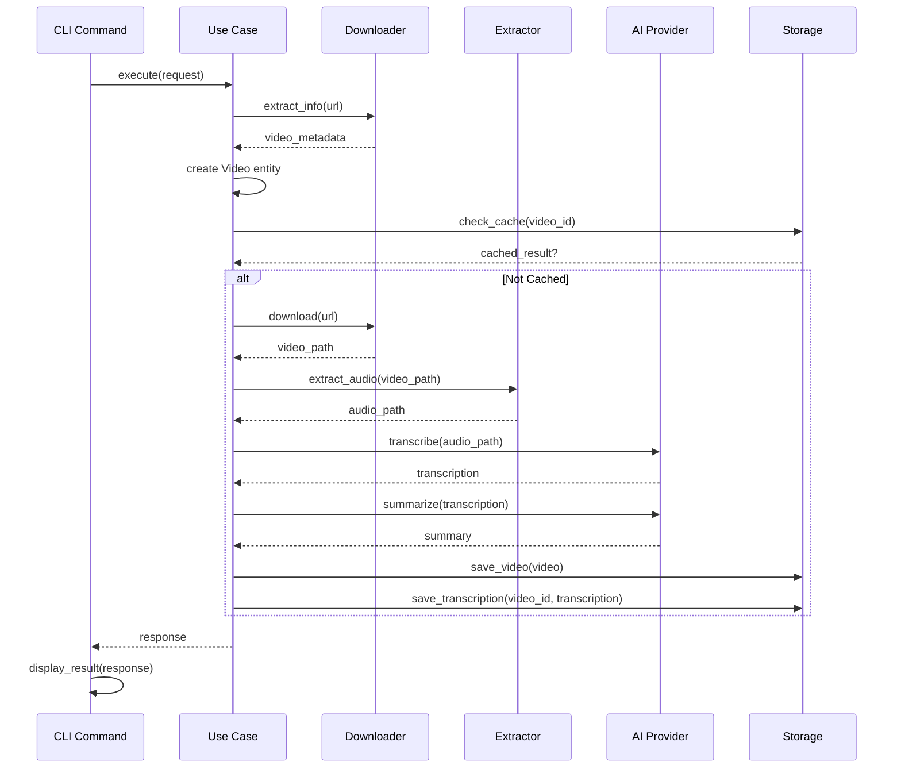

# Arquitetura do Alfredo AI

Este documento detalha a arquitetura completa do sistema Alfredo AI, baseada nos princípios da Clean Architecture.

## Visão Geral

O Alfredo AI é um sistema de análise de vídeo que utiliza IA para transcrição e sumarização. A arquitetura foi projetada seguindo rigorosamente os princípios da Clean Architecture, garantindo:

- **Separação de Responsabilidades**: Cada camada tem responsabilidades bem definidas
- **Independência de Frameworks**: Lógica de negócio independente de tecnologias específicas
- **Testabilidade**: Todas as dependências podem ser mockadas
- **Flexibilidade**: Componentes podem ser substituídos facilmente

## Estrutura de Camadas

```
┌─────────────────────────────────────────────────────────────┐
│                    PRESENTATION LAYER                       │
│  ┌─────────────────┐  ┌─────────────────┐  ┌─────────────┐ │
│  │   CLI Commands  │  │  Interactive UI │  │   Web API   │ │
│  └─────────────────┘  └─────────────────┘  └─────────────┘ │
└─────────────────────────────────────────────────────────────┘
                              │
                              ▼
┌─────────────────────────────────────────────────────────────┐
│                    APPLICATION LAYER                        │
│  ┌─────────────────┐  ┌─────────────────┐  ┌─────────────┐ │
│  │   Use Cases     │  │    Gateways     │  │   Services  │ │
│  │                 │  │  (Interfaces)   │  │             │ │
│  └─────────────────┘  └─────────────────┘  └─────────────┘ │
└─────────────────────────────────────────────────────────────┘
                              │
                              ▼
┌─────────────────────────────────────────────────────────────┐
│                      DOMAIN LAYER                           │
│  ┌─────────────────┐  ┌─────────────────┐  ┌─────────────┐ │
│  │    Entities     │  │   Exceptions    │  │  Validators │ │
│  │                 │  │                 │  │             │ │
│  └─────────────────┘  └─────────────────┘  └─────────────┘ │
└─────────────────────────────────────────────────────────────┘
                              ▲
                              │
┌─────────────────────────────────────────────────────────────┐
│                  INFRASTRUCTURE LAYER                       │
│  ┌─────────────────┐  ┌─────────────────┐  ┌─────────────┐ │
│  │   AI Providers  │  │   Downloaders   │  │   Storage   │ │
│  │                 │  │                 │  │             │ │
│  └─────────────────┘  └─────────────────┘  └─────────────┘ │
└─────────────────────────────────────────────────────────────┘
```

## Camada de Domínio (Domain)

### Responsabilidades
- Definir entidades de negócio
- Implementar regras de negócio
- Definir exceções específicas do domínio
- Validações de dados

### Componentes

#### Entidades
```python
@dataclass
class Video:
    """Entidade central do domínio - representa um vídeo processado"""
    id: str
    title: str
    duration: float = 0.0
    file_path: Optional[str] = None
    url: Optional[str] = None
    transcription: Optional[str] = None
    summary: Optional[str] = None
    metadata: Optional[dict] = None
    created_at: Optional[datetime] = None
    
    def __post_init__(self):
        # Validações de domínio executadas na criação
        self._validate_id()
        self._validate_title()
        self._validate_sources()
        self._validate_duration()
```

#### Exceções Customizadas
```python
class AlfredoError(Exception):
    """Exceção base com suporte a detalhes estruturados"""
    def __init__(self, message: str, details: dict = None, cause: Exception = None):
        self.message = message
        self.details = details or {}
        self.cause = cause
    
    def to_dict(self) -> dict:
        return {
            "error_type": self.__class__.__name__,
            "message": self.message,
            "details": self.details
        }

# Hierarquia de exceções específicas
class ProviderUnavailableError(AlfredoError): pass
class DownloadFailedError(AlfredoError): pass
class TranscriptionError(AlfredoError): pass
class InvalidVideoFormatError(AlfredoError): pass
class ConfigurationError(AlfredoError): pass
```

#### Validadores
```python
def validate_video_id(video_id: str) -> None:
    """Valida formato do ID do vídeo"""
    if not video_id or len(video_id) > 255:
        raise InvalidVideoFormatError("id", video_id, "ID inválido")

def validate_youtube_url(url: str) -> bool:
    """Valida URL do YouTube"""
    patterns = [
        r'^https?://(www\.)?youtube\.com/watch\?v=[\w-]+',
        r'^https?://(www\.)?youtu\.be/[\w-]+'
    ]
    return any(re.match(pattern, url) for pattern in patterns)
```

## Camada de Aplicação (Application)

### Responsabilidades
- Orquestrar fluxos de negócio (Use Cases)
- Definir interfaces para dependências externas (Gateways)
- Coordenar interações entre entidades
- Implementar regras de aplicação

### Use Cases

#### ProcessYouTubeVideoUseCase
```python
class ProcessYouTubeVideoUseCase:
    """Orquestra o processamento completo de um vídeo do YouTube"""
    
    def __init__(self, 
                 video_repository: StorageGateway,
                 ai_provider: AIStrategy,
                 downloader: VideoDownloaderGateway,
                 extractor: AudioExtractorGateway,
                 config: AlfredoConfig):
        # Todas as dependências injetadas
        self._video_repository = video_repository
        self._ai_provider = ai_provider
        self._downloader = downloader
        self._extractor = extractor
        self._config = config
    
    async def execute(self, request: ProcessYouTubeVideoRequest) -> ProcessYouTubeVideoResponse:
        """
        Fluxo completo:
        1. Validar URL e extrair informações
        2. Criar entidade Video com validação
        3. Verificar cache
        4. Download do vídeo
        5. Extração de áudio
        6. Transcrição
        7. Sumarização (opcional)
        8. Persistência
        9. Limpeza
        """
```

### Gateways (Interfaces)

#### VideoDownloaderGateway
```python
class VideoDownloaderGateway(ABC):
    """Interface para download de vídeos"""
    
    @abstractmethod
    async def download(self, url: str, output_dir: str, quality: str = "best") -> str:
        """Baixa vídeo e retorna caminho do arquivo"""
        pass
    
    @abstractmethod
    async def extract_info(self, url: str) -> dict:
        """Extrai metadados sem baixar"""
        pass
    
    @abstractmethod
    async def get_available_formats(self, url: str) -> List[dict]:
        """Lista formatos disponíveis"""
        pass
```

#### AIStrategy
```python
class AIStrategy(ABC):
    """Interface Strategy para provedores de IA"""
    
    @abstractmethod
    async def transcribe(self, audio_path: str, language: Optional[str] = None) -> str:
        """Transcreve áudio para texto"""
        pass
    
    @abstractmethod
    async def summarize(self, text: str, context: Optional[str] = None) -> str:
        """Gera resumo do texto"""
        pass
    
    @abstractmethod
    def get_supported_languages(self) -> List[str]:
        """Retorna idiomas suportados"""
        pass
```

### Services

#### AIStrategyContext
```python
class AIStrategyContext:
    """Gerencia estratégias de IA e seleção automática"""
    
    def get_best_strategy_for_task(self, task: str) -> str:
        """Seleciona melhor estratégia para tarefa específica"""
        if task == "transcription":
            # Whisper e Groq são melhores para transcrição
            return "groq" if "groq" in self._strategies else "whisper"
        elif task == "summarization":
            # Groq e Ollama são melhores para sumarização
            return "groq" if "groq" in self._strategies else "ollama"
```

## Camada de Infraestrutura (Infrastructure)

### Responsabilidades
- Implementar interfaces definidas na camada de aplicação
- Integrar com serviços externos (APIs, bibliotecas)
- Gerenciar persistência de dados
- Configurar dependências

### Provedores de IA

#### WhisperStrategy
```python
class WhisperStrategy(AIStrategy):
    """Implementação usando OpenAI Whisper"""
    
    async def transcribe(self, audio_path: str, language: Optional[str] = None) -> str:
        if self.model is None:
            self.model = whisper.load_model(self.model_name)
        
        result = self.model.transcribe(audio_path, language=language)
        return result["text"].strip()
    
    async def summarize(self, text: str, context: Optional[str] = None) -> str:
        # Whisper não é otimizado para sumarização
        # Implementa resumo básico usando heurísticas
        sentences = text.split('.')
        return '. '.join(sentences[:2] + [sentences[-1]])
```

#### GroqStrategy
```python
class GroqStrategy(AIStrategy):
    """Implementação usando Groq API"""
    
    async def transcribe(self, audio_path: str, language: Optional[str] = None) -> str:
        client = Groq(api_key=self.api_key)
        
        with open(audio_path, "rb") as audio_file:
            transcription = client.audio.transcriptions.create(
                file=audio_file,
                model="whisper-large-v3",
                language=language
            )
        
        return transcription.strip()
    
    async def summarize(self, text: str, context: Optional[str] = None) -> str:
        client = Groq(api_key=self.api_key)
        
        response = client.chat.completions.create(
            model=self.model_name,
            messages=[
                {"role": "system", "content": "Você é um assistente especializado em resumos."},
                {"role": "user", "content": f"Resuma este texto: {text}"}
            ]
        )
        
        return response.choices[0].message.content.strip()
```

### Factory Pattern

#### InfrastructureFactory
```python
class InfrastructureFactory:
    """Centraliza criação de dependências com cache singleton"""
    
    def __init__(self, config: AlfredoConfig):
        self._config = config
        self._instances = {}  # Cache de instâncias
    
    def create_ai_provider(self, provider_type: str = None) -> AIStrategy:
        provider_type = provider_type or self._config.default_ai_provider
        cache_key = f'ai_provider_{provider_type}'
        
        if cache_key not in self._instances:
            if provider_type == "whisper":
                self._instances[cache_key] = WhisperStrategy(self._config)
            elif provider_type == "groq":
                self._instances[cache_key] = GroqStrategy(self._config)
            elif provider_type == "ollama":
                self._instances[cache_key] = OllamaStrategy(self._config)
            else:
                raise ConfigurationError(
                    "ai_provider", 
                    f"Provider '{provider_type}' não suportado"
                )
        
        return self._instances[cache_key]
```

## Camada de Apresentação (Presentation)

### Responsabilidades
- Interagir com usuário (CLI, Web, API)
- Validar entrada do usuário
- Formatar saída
- Delegar para Use Cases

### Command Pattern

#### Base Command
```python
class Command(ABC):
    """Classe base para comandos CLI com funcionalidades avançadas"""
    
    def __init__(self, config: AlfredoConfig, factory: InfrastructureFactory):
        self.config = config
        self.factory = factory
        self._metadata = None
        self._parser = None
        self._sub_commands = {}
        self._flags = []
        
        self._initialize_metadata()
        self._setup_argument_parser()
    
    @abstractmethod
    def _initialize_metadata(self) -> None:
        """Define metadados do comando (nome, descrição, flags, etc.)"""
        pass
    
    async def execute_with_args(self, args: List[str]) -> Any:
        """Executa comando com argumentos da linha de comando"""
        parsed_args = self.parse_arguments(args)
        
        # Verificar sub-comandos
        if hasattr(parsed_args, 'sub_command') and parsed_args.sub_command:
            return await self._execute_sub_command(parsed_args.sub_command, args)
        
        return await self.execute_from_parsed_args(parsed_args)
```

#### CommandRegistry
```python
class CommandRegistry:
    """Registry expandido com descoberta automática"""
    
    def __init__(self, config: AlfredoConfig, factory: InfrastructureFactory):
        self._commands = {}
        self._aliases = {}
        self._categories = {}
        
        self._register_default_commands()
        self._auto_discover_commands()  # Descoberta automática
    
    def _auto_discover_commands(self) -> None:
        """Descobre comandos automaticamente no diretório"""
        commands_path = Path(__file__).parent
        
        for file_path in commands_path.glob("*_command.py"):
            module = importlib.import_module(f"src.presentation.cli.{file_path.stem}")
            
            for name, obj in inspect.getmembers(module, inspect.isclass):
                if issubclass(obj, Command) and obj != Command:
                    command_name = name.replace("Command", "").lower()
                    self.register_command(command_name, obj)
```

## Configuração Centralizada

### Constantes Centralizadas

O projeto implementa um sistema robusto de constantes centralizadas em `src/config/constants.py`:

```python
# Constantes de aplicação
APP_NAME = "Alfredo AI"
APP_VERSION = "2.0.0"

# Modelos de IA padrão
DEFAULT_GROQ_MODEL = 'llama-3.3-70b-versatile'
DEFAULT_WHISPER_MODEL = 'base'

# Timeouts e limites
DEFAULT_DOWNLOAD_TIMEOUT = 300  # 5 minutos
MAX_VIDEO_DURATION_HOURS = 24

# Enums para valores relacionados
class AIProvider(Enum):
    WHISPER = 'whisper'
    GROQ = 'groq'
    OLLAMA = 'ollama'

class ProcessingStatus(Enum):
    PENDING = 'pending'
    DOWNLOADING = 'downloading'
    TRANSCRIBING = 'transcribing'
    COMPLETED = 'completed'
```

**Benefícios das Constantes Centralizadas:**
- Eliminação de magic numbers e strings
- Facilita manutenção e alterações
- Reduz erros de digitação
- Melhora legibilidade do código
- Permite validação centralizada

### AlfredoConfig
```python
@dataclass
class AlfredoConfig:
    """Configuração tipada centralizada com validação automática"""
    
    # Modelos de IA
    groq_model: str = "llama-3.3-70b-versatile"
    ollama_model: str = "llama3:8b"
    whisper_model: str = "base"
    default_ai_provider: str = "whisper"
    
    # Timeouts e Limites
    max_video_duration: int = 86400  # 24 horas
    download_timeout: int = 300
    transcription_timeout: int = 600
    max_file_size_mb: int = 500
    
    # API Keys
    groq_api_key: Optional[str] = field(default_factory=lambda: os.getenv("GROQ_API_KEY"))
    
    def __post_init__(self):
        self._validate_timeouts()
        self._validate_limits()
        self._validate_directories()
    
    def validate_runtime(self) -> None:
        """Validações que dependem de recursos externos"""
        if self.default_ai_provider == "groq" and not self.groq_api_key:
            raise ConfigurationError("groq_api_key", "obrigatória para provider groq")
```

## Fluxo de Dados

### Processamento de Vídeo do YouTube



## Princípios Arquiteturais

### 1. Regra de Dependência
- **Domain**: Não depende de nenhuma camada externa
- **Application**: Depende apenas de Domain
- **Infrastructure**: Implementa interfaces de Application
- **Presentation**: Usa apenas Application

### 2. Inversão de Dependência
```python
# ❌ Dependência direta (acoplamento alto)
class ProcessVideoUseCase:
    def __init__(self):
        self.downloader = YTDLPDownloader()  # Dependência concreta
        self.ai_provider = WhisperProvider()  # Dependência concreta

# ✅ Inversão de dependência (baixo acoplamento)
class ProcessVideoUseCase:
    def __init__(self, 
                 downloader: VideoDownloaderGateway,  # Interface
                 ai_provider: AIStrategy):            # Interface
        self.downloader = downloader
        self.ai_provider = ai_provider
```

### 3. Separação de Responsabilidades
- **Entities**: Regras de negócio e validações
- **Use Cases**: Orquestração de fluxos
- **Gateways**: Abstração de dependências externas
- **Infrastructure**: Implementação de detalhes técnicos
- **Presentation**: Interface com usuário

### 4. Testabilidade
```python
# Teste de Use Case com mocks
@pytest.mark.asyncio
async def test_process_youtube_video():
    # Arrange
    mock_downloader = Mock(spec=VideoDownloaderGateway)
    mock_ai_provider = Mock(spec=AIStrategy)
    mock_storage = Mock(spec=StorageGateway)
    
    use_case = ProcessYouTubeVideoUseCase(
        downloader=mock_downloader,
        ai_provider=mock_ai_provider,
        storage=mock_storage
    )
    
    # Act
    result = await use_case.execute(request)
    
    # Assert
    assert result is not None
    mock_downloader.download.assert_called_once()
    mock_ai_provider.transcribe.assert_called_once()
```

## Benefícios da Arquitetura

### 1. Manutenibilidade
- Código organizado em responsabilidades claras
- Mudanças isoladas em camadas específicas
- Fácil localização de bugs

### 2. Testabilidade
- 100% das dependências podem ser mockadas
- Testes unitários isolados
- Testes de integração controlados

### 3. Extensibilidade
- Novos provedores de IA em < 1 hora
- Novos comandos CLI descobertos automaticamente
- Novas interfaces de usuário sem afetar lógica

### 4. Flexibilidade
- Troca de implementações sem afetar outras camadas
- Configuração centralizada e tipada
- Suporte a múltiplos ambientes

### 5. Robustez
- Tratamento de erros específico e estruturado
- Validações em múltiplas camadas
- Recuperação automática de falhas

## Métricas de Qualidade

### Cobertura de Testes
- **Target**: 80% mínimo
- **Domain**: 100% (crítico)
- **Application**: 95% (Use Cases)
- **Infrastructure**: 80% (integrações)

#### Ferramentas de Análise de Cobertura

O projeto inclui análise automatizada de cobertura com:

```bash
# Análise completa com relatório detalhado
make coverage-analysis

# Análise rápida usando coverage.json existente
make coverage-analysis-quick

# Verificação de regressão automática
make coverage-regression
```

**Funcionalidades da Análise:**
- Relatórios detalhados por módulo
- Identificação automática de módulos com baixa cobertura
- Sugestões específicas de melhoria
- Detecção de regressão com baseline automático
- Relatórios HTML e texto estruturado
- Métricas de linhas cobertas/não cobertas

**Estrutura de Relatórios:**
```
data/output/reports/
├── coverage_detailed.txt      # Relatório completo
├── coverage_quick.txt         # Análise rápida
├── coverage_baseline.json     # Baseline para regressão
└── quality_report_*.txt       # Relatórios de qualidade
```

### Complexidade
- **Complexidade Ciclomática**: ≤ 10 por função
- **Linhas por Função**: ≤ 20
- **Linhas por Classe**: ≤ 200

### Acoplamento
- **Dependências Externas**: Apenas via interfaces
- **Injeção de Dependência**: 100% implementada
- **Magic Numbers/Strings**: Zero ocorrências

### Pipeline de Qualidade

O projeto implementa um pipeline completo de qualidade:

```bash
# Verificação completa de qualidade
make quality-check

# Relatório abrangente de qualidade
make quality-report

# Pipeline paralelo para CI/CD
make quality-check-parallel
```

**Verificações Incluídas:**
- Formatação de código (black, isort)
- Análise estática (flake8, pylint)
- Verificação de tipos (mypy)
- Análise de complexidade
- Detecção de duplicação
- Análise de segurança (bandit, safety)
- Cobertura de testes com regressão

Esta arquitetura serve como referência de excelência para projetos Python que seguem Clean Architecture, demonstrando como implementar todos os princípios de forma prática e eficiente.