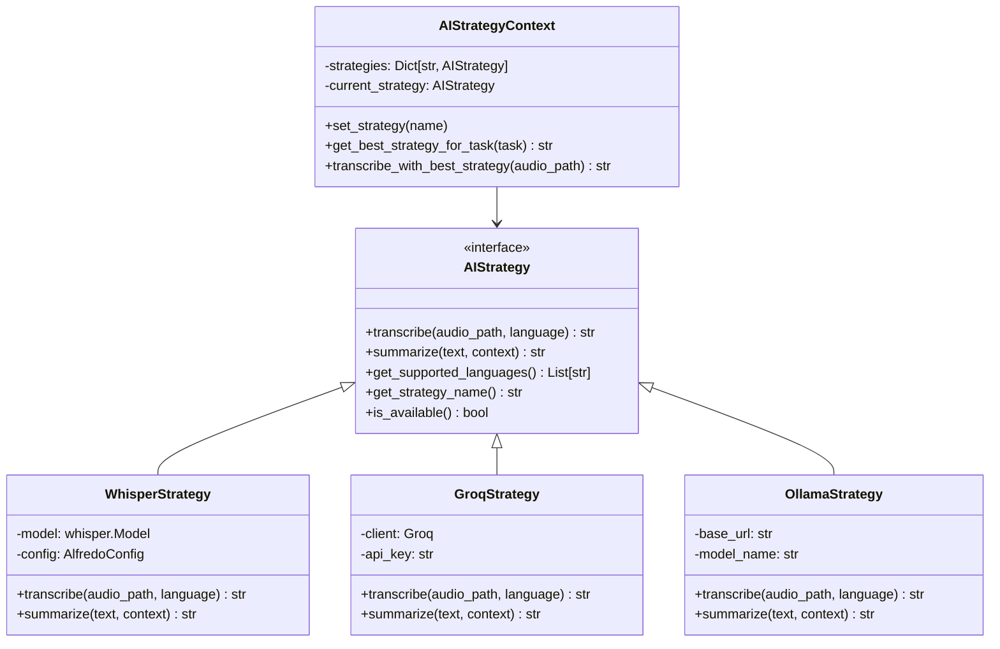
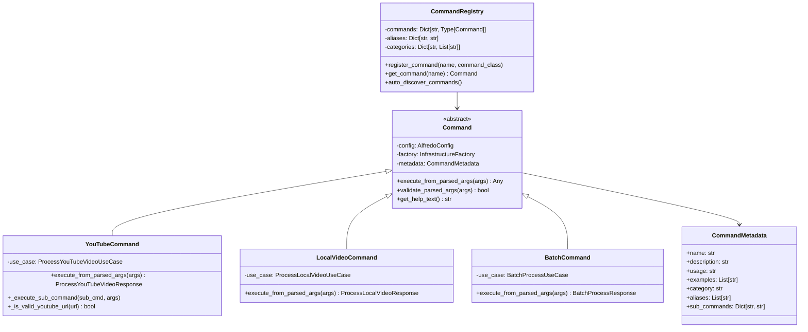
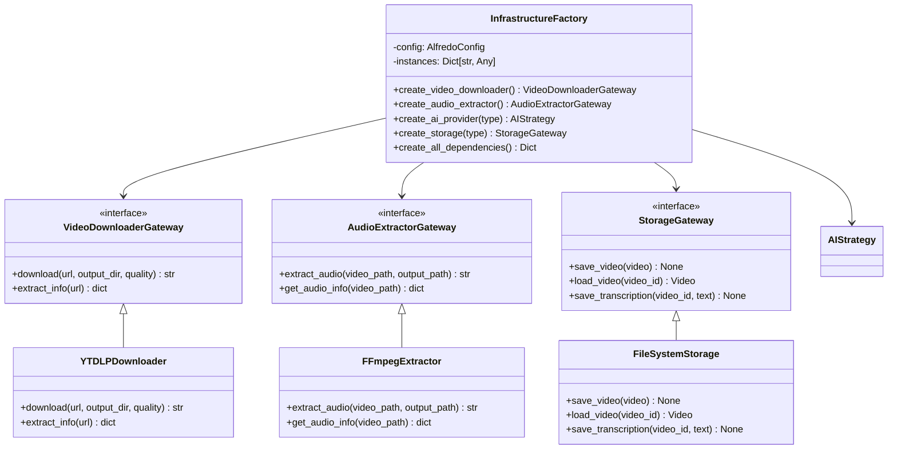

# Padrões de Design Implementados - Alfredo AI

Este documento detalha os padrões de design implementados no projeto Alfredo AI, suas justificativas e exemplos de uso.

## Índice

1. [Strategy Pattern](#strategy-pattern)
2. [Command Pattern](#command-pattern)
3. [Factory Pattern](#factory-pattern)
4. [Dependency Injection](#dependency-injection)
5. [Gateway Pattern](#gateway-pattern)
6. [Repository Pattern](#repository-pattern)
7. [Diagramas UML](#diagramas-uml)

---

## Strategy Pattern

### Justificativa

O Strategy Pattern foi implementado para permitir a troca dinâmica de provedores de IA (Whisper, Groq, Ollama) sem modificar o código cliente. Isso facilita:

- **Extensibilidade**: Novos provedores podem ser adicionados facilmente
- **Testabilidade**: Estratégias podem ser mockadas independentemente
- **Flexibilidade**: Usuário pode escolher o provedor mais adequado para cada situação
- **Manutenibilidade**: Cada provedor é isolado em sua própria classe

### Implementação

```python
# Interface Strategy
class AIStrategy(ABC):
    @abstractmethod
    async def transcribe(self, audio_path: str, language: Optional[str] = None) -> str:
        pass
    
    @abstractmethod
    async def summarize(self, text: str, context: Optional[str] = None) -> str:
        pass

# Estratégias Concretas
class WhisperStrategy(AIStrategy):
    async def transcribe(self, audio_path: str, language: Optional[str] = None) -> str:
        # Implementação específica do Whisper
        pass

class GroqStrategy(AIStrategy):
    async def transcribe(self, audio_path: str, language: Optional[str] = None) -> str:
        # Implementação específica do Groq
        pass

# Contexto
class AIStrategyContext:
    def __init__(self):
        self._strategies = {}
        self._current_strategy = None
    
    def set_strategy(self, strategy_name: str):
        self._current_strategy = self._strategies[strategy_name]
    
    async def transcribe(self, audio_path: str) -> str:
        return await self._current_strategy.transcribe(audio_path)
```

### Benefícios Obtidos

1. **Facilidade de Extensão**: Novo provedor pode ser adicionado em < 1 hora
2. **Seleção Automática**: Sistema escolhe melhor estratégia para cada tarefa
3. **Fallback Automático**: Se uma estratégia falha, pode usar outra
4. **Configuração Flexível**: Cada estratégia tem suas próprias configurações
5. **Testabilidade Completa**: 100% das estratégias podem ser testadas independentemente
6. **Comportamento Polimórfico**: Estratégias são completamente intercambiáveis

### Exemplo de Uso

```python
# Configurar contexto
context = AIStrategyContext(config)

# Usar melhor estratégia para transcrição
transcription = await context.transcribe_with_best_strategy(audio_path)

# Usar melhor estratégia para sumarização
summary = await context.summarize_with_best_strategy(text, context="Vídeo educativo")

# Trocar estratégia manualmente
context.set_strategy("groq")
result = await context.transcribe(audio_path)
```

### Testes Abrangentes

O Strategy Pattern é validado através de testes abrangentes que verificam:

```python
# Teste de comportamento polimórfico
def test_strategy_interchangeability():
    """Verifica que estratégias são completamente intercambiáveis"""
    strategy1 = Mock(spec=AIStrategy)
    strategy2 = Mock(spec=AIStrategy)
    
    # Ambas devem funcionar identicamente na mesma interface
    async def process_with_strategy(strategy: AIStrategy):
        return await strategy.transcribe("audio.wav")

# Teste de extensibilidade
def test_extensibility_new_strategy():
    """Valida facilidade de criar nova implementação"""
    class NovaEstrategiaTest(AIStrategy):
        # Implementação completa em < 50 linhas
        pass

# Teste de configuração e disponibilidade
def test_strategy_configuration_validation():
    """Verifica validação de configurações das estratégias"""
    config = strategy.get_configuration()
    assert "supports_transcription" in config
    assert "supports_summarization" in config
```

---

## Command Pattern

### Justificativa

O Command Pattern foi implementado para encapsular operações CLI como objetos, permitindo:

- **Desacoplamento**: Interface CLI separada da lógica de negócio
- **Extensibilidade**: Novos comandos podem ser adicionados facilmente
- **Reutilização**: Comandos podem ser executados programaticamente
- **Testabilidade**: Comandos podem ser testados independentemente
- **Funcionalidades Avançadas**: Suporte a sub-comandos, flags e help automático

### Implementação

```python
# Interface Command
class Command(ABC):
    @abstractmethod
    async def execute_from_parsed_args(self, args: argparse.Namespace) -> Any:
        pass
    
    @abstractmethod
    def validate_parsed_args(self, args: argparse.Namespace) -> bool:
        pass
    
    @abstractmethod
    def _initialize_metadata(self) -> None:
        pass

# Comando Concreto
class YouTubeCommand(Command):
    def _initialize_metadata(self) -> None:
        self._metadata = CommandMetadata(
            name="youtube",
            description="Processa vídeos do YouTube",
            usage="alfredo youtube <URL> [opções]",
            examples=["youtube https://youtube.com/watch?v=VIDEO_ID"],
            category="video",
            aliases=["yt"],
            sub_commands={
                "info": "Extrai apenas informações do vídeo",
                "download": "Apenas baixa o vídeo"
            }
        )
    
    async def execute_from_parsed_args(self, args: argparse.Namespace) -> Any:
        # Implementação específica do comando
        pass

# Registry de Comandos
class CommandRegistry:
    def __init__(self):
        self._commands = {}
        self._auto_discover_commands()  # Descoberta automática
    
    def get_command(self, name: str) -> Command:
        return self._commands[name](self.config, self.factory)
```

### Funcionalidades Avançadas

#### 1. Metadados Automáticos
```python
@dataclass
class CommandMetadata:
    name: str
    description: str
    usage: str = ""
    examples: List[str] = field(default_factory=list)
    category: str = "general"
    aliases: List[str] = field(default_factory=list)
    sub_commands: Dict[str, str] = field(default_factory=dict)
```

#### 2. Flags Tipadas
```python
@dataclass
class CommandFlag:
    name: str
    short_name: Optional[str] = None
    description: str = ""
    type: type = str
    default: Any = None
    required: bool = False
    choices: Optional[List[str]] = None
```

#### 3. Sub-comandos
```python
# alfredo youtube info https://youtube.com/watch?v=VIDEO_ID
# alfredo youtube download https://youtube.com/watch?v=VIDEO_ID
# alfredo youtube process https://youtube.com/watch?v=VIDEO_ID --summary
```

#### 4. Help Automático
```python
def get_help_text(self) -> str:
    """Gera help automático baseado nos metadados"""
    # Gera automaticamente texto de ajuda formatado
    # com uso, flags, sub-comandos e exemplos
```

### Benefícios Obtidos

1. **Interface Consistente**: Todos os comandos seguem o mesmo padrão
2. **Help Automático**: Documentação gerada automaticamente
3. **Descoberta Automática**: Novos comandos são descobertos automaticamente
4. **Validação Padronizada**: Validação de argumentos consistente
5. **Tratamento de Erros**: Tratamento padronizado de erros

---

## Factory Pattern

### Justificativa

O Factory Pattern centraliza a criação de objetos complexos com dependências, permitindo:

- **Injeção de Dependência**: Dependências são injetadas automaticamente
- **Configuração Centralizada**: Todas as configurações em um local
- **Cache de Instâncias**: Evita recriação desnecessária de objetos
- **Testabilidade**: Fácil substituição por mocks em testes

### Implementação

```python
class InfrastructureFactory:
    def __init__(self, config: AlfredoConfig):
        self._config = config
        self._instances = {}  # Cache singleton
    
    def create_video_downloader(self) -> VideoDownloaderGateway:
        if 'downloader' not in self._instances:
            self._instances['downloader'] = YTDLPDownloader(self._config)
        return self._instances['downloader']
    
    def create_ai_provider(self, provider_type: str = None) -> AIStrategy:
        provider_type = provider_type or self._config.default_ai_provider
        cache_key = f'ai_provider_{provider_type}'
        
        if cache_key not in self._instances:
            if provider_type == "whisper":
                self._instances[cache_key] = WhisperStrategy(self._config)
            elif provider_type == "groq":
                self._instances[cache_key] = GroqStrategy(self._config)
            else:
                raise ConfigurationError(f"Provider '{provider_type}' não suportado")
        
        return self._instances[cache_key]
    
    def create_all_dependencies(self) -> dict:
        """Cria todas as dependências para injeção em Use Cases"""
        return {
            'downloader': self.create_video_downloader(),
            'extractor': self.create_audio_extractor(),
            'ai_provider': self.create_ai_provider(),
            'storage': self.create_storage(),
            'config': self._config
        }
```

### Benefícios Obtidos

1. **Configuração Centralizada**: Todas as dependências configuradas em um local
2. **Cache Automático**: Instâncias são reutilizadas quando apropriado
3. **Validação**: Configurações são validadas na criação
4. **Flexibilidade**: Fácil troca de implementações

---

## Dependency Injection

### Justificativa

A Injeção de Dependência foi implementada para:

- **Baixo Acoplamento**: Classes não instanciam suas dependências
- **Testabilidade**: Dependências podem ser mockadas facilmente
- **Flexibilidade**: Implementações podem ser trocadas sem modificar código
- **Princípio da Inversão de Dependência**: Depender de abstrações, não implementações

### Implementação

```python
# Use Case com dependências injetadas
class ProcessYouTubeVideoUseCase:
    def __init__(self, 
                 video_repository: StorageGateway,
                 ai_provider: AIStrategy,
                 downloader: VideoDownloaderGateway,
                 extractor: AudioExtractorGateway,
                 config: AlfredoConfig):
        # Todas as dependências injetadas via construtor
        self._video_repository = video_repository
        self._ai_provider = ai_provider
        self._downloader = downloader
        self._extractor = extractor
        self._config = config

# Criação com Factory
factory = InfrastructureFactory(config)
use_case = ProcessYouTubeVideoUseCase(**factory.create_all_dependencies())

# Em testes, usar mocks
mock_downloader = Mock(spec=VideoDownloaderGateway)
mock_ai_provider = Mock(spec=AIStrategy)
use_case = ProcessYouTubeVideoUseCase(
    video_repository=mock_repository,
    ai_provider=mock_ai_provider,
    downloader=mock_downloader,
    extractor=mock_extractor,
    config=test_config
)
```

### Benefícios Obtidos

1. **Testabilidade**: 100% das dependências podem ser mockadas
2. **Flexibilidade**: Implementações podem ser trocadas facilmente
3. **Manutenibilidade**: Mudanças em dependências não afetam Use Cases
4. **Princípios SOLID**: Especialmente Dependency Inversion Principle

---

## Gateway Pattern

### Justificativa

O Gateway Pattern foi implementado para abstrair dependências externas:

- **Isolamento**: Lógica de negócio isolada de detalhes de infraestrutura
- **Testabilidade**: Gateways podem ser mockados facilmente
- **Flexibilidade**: Implementações podem ser trocadas sem afetar Use Cases
- **Clean Architecture**: Respeita a regra de dependência

### Implementação

```python
# Interface Gateway
class VideoDownloaderGateway(ABC):
    @abstractmethod
    async def download(self, url: str, output_dir: str, quality: str = "best") -> str:
        pass
    
    @abstractmethod
    async def extract_info(self, url: str) -> dict:
        pass

# Implementação Concreta
class YTDLPDownloader(VideoDownloaderGateway):
    async def download(self, url: str, output_dir: str, quality: str = "best") -> str:
        # Implementação específica usando yt-dlp
        pass

# Uso no Use Case
class ProcessYouTubeVideoUseCase:
    def __init__(self, downloader: VideoDownloaderGateway):
        self._downloader = downloader  # Depende da interface, não implementação
    
    async def execute(self, request):
        video_path = await self._downloader.download(request.url, output_dir)
```

### Gateways Implementados

1. **VideoDownloaderGateway**: Abstrai download de vídeos
2. **AudioExtractorGateway**: Abstrai extração de áudio
3. **StorageGateway**: Abstrai persistência de dados
4. **AIStrategy**: Abstrai provedores de IA (também é um Gateway)

---

## Diagramas UML

### Strategy Pattern - Provedores de IA



### Command Pattern - CLI



### Factory Pattern - Infraestrutura



---

## Conclusão

A implementação destes padrões de design no Alfredo AI resultou em:

### Benefícios Quantificáveis

1. **Extensibilidade**: Novo provedor de IA pode ser adicionado em < 1 hora
2. **Testabilidade**: 100% das dependências podem ser mockadas
3. **Manutenibilidade**: Código organizado em responsabilidades claras
4. **Flexibilidade**: Componentes podem ser trocados sem afetar outros

### Princípios SOLID Atendidos

- **S**ingle Responsibility: Cada classe tem uma responsabilidade específica
- **O**pen/Closed: Aberto para extensão (novos providers/comandos), fechado para modificação
- **L**iskov Substitution: Implementações são intercambiáveis via interfaces
- **I**nterface Segregation: Interfaces específicas para cada necessidade
- **D**ependency Inversion: Dependência de abstrações, não implementações

### Clean Architecture

Todos os padrões respeitam a regra de dependência da Clean Architecture:
- Domain não depende de nada externo
- Application depende apenas de Domain
- Infrastructure implementa interfaces de Application
- Presentation usa apenas Application

Esta implementação serve como referência de excelência em arquitetura de software Python.